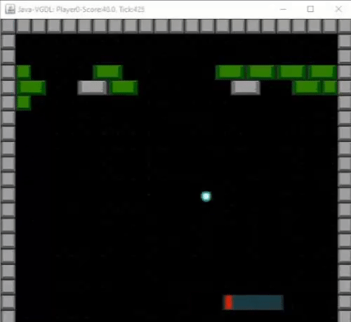

# QLearning-Arkanoid 
QLearning algorithm of Reinforcement Learning implemented in the GVGAI platform to solve the 80th game, called Roadfighter.

## Instructions
- Import project into IDE (we used Eclipse IDE)
- Run main .java file:
`GVGAI/src/tracks/singlePlayer/Test.java`

## Explanation video (spanish)

## References
- https://stackoverflow.com/questions/38931111/how-to-make-plots-in-java-like-in-matlab-same-syntax
- https://kunuk.wordpress.com/2010/09/24/q-learning/
- https://www.geeksforgeeks.org/q-learning-in-python/
